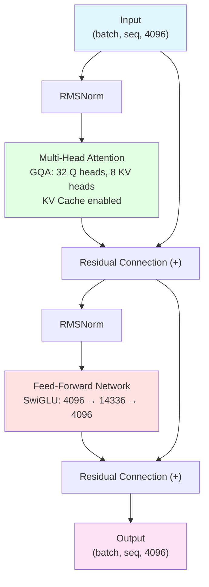
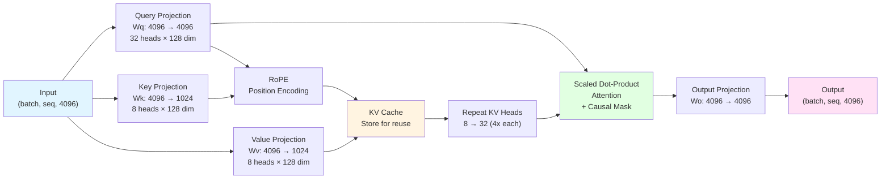
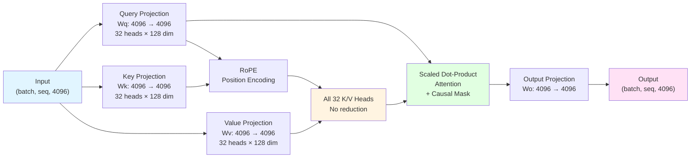
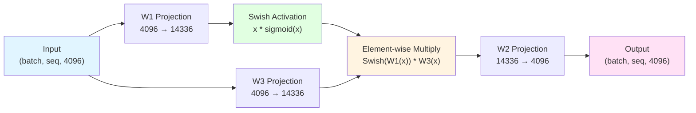
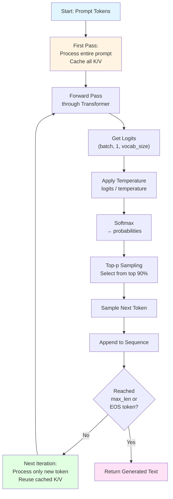
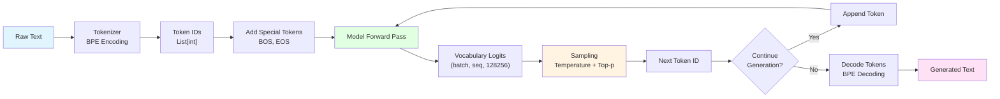
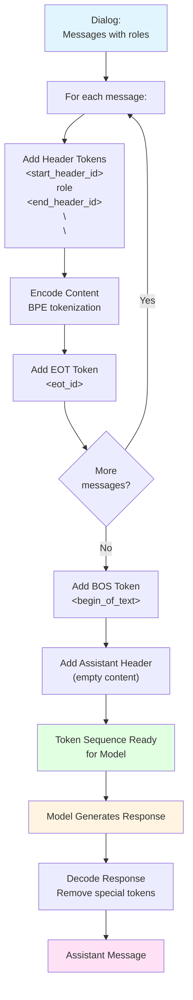

# Llama 3 From Scratch

A complete, well-documented implementation of the Llama 3 transformer model architecture from scratch. This implementation includes all core components: model architecture, tokenization, inference, and text generation.

## Overview

This project implements the Llama 3 (8B parameter) transformer model with the following key features:

- **Grouped Query Attention (GQA)**: Efficient attention mechanism with fewer key-value heads
- **Rotary Position Embeddings (RoPE)**: Position encoding with extended context length support
- **RMSNorm**: Root Mean Square Layer Normalization
- **SwiGLU Activation**: Gated linear unit with Swish activation
- **KV Cache**: Efficient autoregressive generation with cached keys and values
- **Chat Formatting**: Support for conversational interactions

## Architecture

The model follows the Llama 3 architecture specifications:

- **Model Dimension**: 4096
- **Feed-Forward Dimension**: 14336
- **Number of Layers**: 32
- **Number of Attention Heads**: 32
- **Number of Key-Value Heads**: 8 (GQA)
- **Vocabulary Size**: 128,256 tokens
- **RoPE Theta**: 500,000 (extended context)

## Project Structure

```
llama-3-from-scratch/
├── config.py          # Model hyperparameters and constants
├── rope.py            # Rotary Position Embedding utilities
├── model.py           # Model architecture (RMSNorm, FFN, Attention, Transformer)
├── tokenizer.py       # Tokenizer and chat formatting
├── inference.py       # Text generation and inference
├── example.py         # Usage examples
└── README.md          # This file
```

## Architecture Diagram

> **Note**: If the diagram below doesn't render, you can view it at [Mermaid Live Editor](https://mermaid.live) by copying the code, or use a markdown viewer that supports Mermaid (like GitHub, GitLab, or VS Code with Mermaid extension).

### High-Level Architecture

```mermaid
graph LR
    A["Token IDs<br/>(batch, seq_len)"] --> B["Token Embeddings<br/>(batch, seq_len, 4096)"]
    B --> C["RoPE Position Encoding"]
    C --> D["Transformer Block 1"]
    D --> E["Transformer Block 2"]
    E --> F["..."]
    F --> G["Transformer Block 32"]
    G --> H["Final RMSNorm"]
    H --> I["Output Projection<br/>(4096 → 128256)"]
    I --> J["Vocabulary Logits<br/>(batch, seq_len, 128256)"]
    
    style A fill:#e1f5ff
    style J fill:#ffe1f5
    style D fill:#fff4e1
    style E fill:#fff4e1
    style G fill:#fff4e1
```



**Component Descriptions:**

- **Token IDs (A)**: Integer representations of tokens from the vocabulary. Each token in the input sequence is mapped to a unique integer ID (0 to 128,255). Shape: `(batch_size, sequence_length)`.

- **Token Embeddings (B)**: Dense vector representations learned for each token. The embedding layer converts discrete token IDs into continuous 4096-dimensional vectors that capture semantic information. This is the first learnable transformation in the model.

- **RoPE Position Encoding (C)**: Rotary Position Embedding applied to encode absolute and relative positional information. Unlike fixed positional encodings, RoPE rotates query and key vectors based on their positions, allowing the model to understand token order and relative distances.

- **Transformer Blocks 1-32 (D, E, F, G)**: Stack of 32 identical transformer layers. Each block contains:
  - Multi-head attention with Grouped Query Attention (GQA)
  - Feed-forward network with SwiGLU activation
  - Residual connections and RMSNorm layers
  - These blocks progressively refine the representations, building higher-level abstractions

- **Final RMSNorm (H)**: Root Mean Square normalization applied after all transformer blocks. This stabilizes the output before the final projection, ensuring numerical stability and consistent scaling.

- **Output Projection (I)**: Linear layer that maps the 4096-dimensional hidden states to the vocabulary size (128,256). This produces unnormalized logits (scores) for each token in the vocabulary, indicating how likely each token is to be the next token.

- **Vocabulary Logits (J)**: Final output containing scores for all possible next tokens. These logits are used to compute probabilities via softmax, and the model samples from this distribution to generate the next token during autoregressive generation.

### Transformer Block Detail



**Component Descriptions:**

- **Input (A)**: The hidden state tensor from the previous layer (or token embeddings for the first block). Contains contextual information about the input sequence. Shape: `(batch_size, sequence_length, 4096)`.

- **RMSNorm (B)**: First normalization layer using Root Mean Square normalization. Normalizes the input by dividing by the root mean square, making training more stable. This is a "pre-norm" architecture where normalization happens before the sub-layer.

- **Multi-Head Attention (C)**: Grouped Query Attention mechanism that allows tokens to attend to each other:
  - **32 Query Heads**: Each head processes a different subspace, allowing the model to focus on different types of relationships
  - **8 Key-Value Heads**: Computed once and repeated 4 times to match query heads, reducing memory and computation
  - **KV Cache**: Stores computed keys and values for efficient autoregressive generation, avoiding recomputation of previous tokens

- **Residual Connection (D)**: Adds the original input to the attention output. This allows gradients to flow directly through the network, enabling deeper networks and better training. The residual connection helps preserve information and enables identity mapping.

- **RMSNorm (E)**: Second normalization layer before the feed-forward network. Ensures the input to the FFN is properly normalized, improving training stability and convergence.

- **Feed-Forward Network (F)**: Two-layer MLP with SwiGLU activation:
  - Expands dimension from 4096 to 14336 (3.5x expansion)
  - Applies SwiGLU gating mechanism
  - Projects back to 4096 dimensions
  - Provides non-linear transformations and increases model capacity

- **Residual Connection (G)**: Second residual connection adding the output before FFN to the FFN output. This completes the transformer block's residual structure, allowing information to bypass both attention and FFN if needed.

- **Output (H)**: The transformed hidden state after one complete transformer block. This output becomes the input to the next transformer block or the final normalization layer.

### Attention Mechanism (GQA)



**Component Descriptions:**

- **Input (A)**: Normalized hidden states from RMSNorm. Contains contextual information that will be transformed into queries, keys, and values. Shape: `(batch_size, sequence_length, 4096)`.

- **Query Projection (B)**: Linear transformation `Wq` that projects input to query vectors. Creates 32 query heads, each with 128 dimensions (32 × 128 = 4096). Queries represent "what information am I looking for?" and are used to attend to relevant parts of the sequence.

- **Key Projection (C)**: Linear transformation `Wk` that projects input to key vectors. Creates only 8 key heads (8 × 128 = 1024), reducing memory and computation. Keys represent "what information do I have?" and are matched against queries.

- **Value Projection (D)**: Linear transformation `Wv` that projects input to value vectors. Also creates 8 value heads (8 × 128 = 1024). Values represent "the actual information content" that is retrieved when queries match keys.

- **RoPE Position Encoding (E)**: Applies Rotary Position Embeddings to queries and keys. This encodes positional information by rotating the vectors in the complex plane based on their positions. Enables the model to understand relative and absolute positions without adding positional embeddings.

- **KV Cache (F)**: Storage mechanism for computed keys and values. During autoregressive generation:
  - First pass: Computes and stores K/V for all prompt tokens
  - Subsequent passes: Only computes K/V for new token, reuses cached values
  - Reduces computation from O(n²) to O(n) for n tokens

- **Repeat KV Heads (G)**: Replicates each of the 8 key-value heads 4 times to match the 32 query heads. This allows all 32 query heads to attend to the same set of 8 key-value heads, implementing Grouped Query Attention efficiently.

- **Scaled Dot-Product Attention (H)**: Core attention computation:
  - Computes attention scores: `QK^T / sqrt(head_dim)`
  - Applies causal mask to prevent attending to future tokens
  - Applies softmax to get attention weights
  - Multiplies weights by values to get weighted sum
  - Each token's output is a weighted combination of all previous tokens

- **Output Projection (I)**: Linear transformation `Wo` that combines all attention heads back into a single representation. Projects from 4096 (32 heads × 128 dim) back to 4096, aggregating information from all attention heads.

- **Output (J)**: The attention output containing contextualized representations. Each token's representation now contains information from all previous tokens it can attend to, weighted by relevance.

### Traditional Multi-Head Attention (MHA) - For Comparison



**Component Descriptions (Traditional MHA):**

- **Input (A)**: Same as GQA - normalized hidden states. Shape: `(batch_size, sequence_length, 4096)`.

- **Query Projection (B)**: Linear transformation creating 32 query heads, each with 128 dimensions. **Same as GQA** - 32 heads × 128 dim = 4096.

- **Key Projection (C)**: Linear transformation creating **32 key heads** (not 8 like GQA). Each head has 128 dimensions. **Key difference**: Traditional MHA computes 32 separate key heads, requiring more memory and computation than GQA's 8 heads.

- **Value Projection (D)**: Linear transformation creating **32 value heads** (not 8 like GQA). Each head has 128 dimensions. **Key difference**: Traditional MHA computes 32 separate value heads, doubling the memory and computation compared to GQA.

- **RoPE Position Encoding (E)**: Same as GQA - applies Rotary Position Embeddings to queries and keys to encode positional information.

- **All 32 K/V Heads (F)**: **Key difference from GQA**: 
  - Traditional MHA computes and stores all 32 key-value heads separately
  - No reduction or repetition needed
  - Each of the 32 query heads has its own unique key-value pair
  - Requires 4× more memory for K/V cache than GQA (32 vs 8 heads)

- **Scaled Dot-Product Attention (G)**: Same attention computation as GQA:
  - Computes attention scores: `QK^T / sqrt(head_dim)`
  - Applies causal mask
  - Softmax to get attention weights
  - Weighted sum with values
  - **Difference**: Each query head attends to its own unique key-value pair (not shared like in GQA)

- **Output Projection (H)**: Same as GQA - combines all 32 attention heads back into a single 4096-dimensional representation.

- **Output (I)**: Same as GQA - contextualized representations where each token contains information from all previous tokens.

**GQA vs Traditional MHA Comparison:**

| Aspect | Traditional MHA | GQA (Llama 3) |
|--------|----------------|---------------|
| Query Heads | 32 | 32 |
| Key Heads | 32 | 8 (repeated 4×) |
| Value Heads | 32 | 8 (repeated 4×) |
| K/V Memory | 100% | 25% (4× reduction) |
| K/V Computation | 100% | 25% (4× reduction) |
| Attention Quality | Full diversity | Slightly reduced (shared KV) |
| Use Case | Training, full attention | Inference, efficient generation |

**Key Insight**: GQA maintains the same number of query heads (32) for diverse attention patterns, but shares key-value heads (8) across query heads. This reduces memory and computation by 75% during inference while maintaining most of the model's quality, making it ideal for efficient autoregressive generation.

### Feed-Forward Network (SwiGLU)



**Component Descriptions:**

- **Input (A)**: Normalized hidden states from RMSNorm after attention. Shape: `(batch_size, sequence_length, 4096)`. Contains contextualized information from the attention mechanism.

- **W1 Projection (B)**: First linear transformation that expands the dimension from 4096 to 14336 (3.5× expansion). This is the "main" projection that will be activated. The expansion provides more capacity for the model to learn complex transformations.

- **W3 Projection (C)**: Second linear transformation, also expanding from 4096 to 14336. This is the "gate" projection in the SwiGLU mechanism. It controls which parts of the W1 output are passed through.

- **Swish Activation (D)**: Applies the Swish activation function to the W1 output. Swish is defined as `x * sigmoid(x)`, which is a smooth, non-monotonic activation function. It's similar to ReLU but with smooth gradients everywhere, making it easier to train.

- **Element-wise Multiply (E)**: The core of SwiGLU - multiplies the Swish-activated W1 output with the W3 (gate) output element-wise. This creates a gating mechanism where:
  - W3 acts as a learned gate that controls information flow
  - Only parts of W1's output that pass through the gate are retained
  - This selective gating helps the model focus on relevant information

- **W2 Projection (F)**: Final linear transformation that projects back from 14336 to 4096 dimensions. This compresses the expanded representation back to the original dimension, completing the feed-forward transformation.

- **Output (G)**: The transformed hidden states after the feed-forward network. This output will be added to the input via residual connection, allowing the model to learn incremental updates to the representations.

### Autoregressive Generation Loop



**Component Descriptions:**

- **Start: Prompt Tokens (A)**: The initial input sequence provided by the user. This is tokenized text that the model will continue or respond to. Example: "The meaning of life is" → [token_ids].

- **First Pass (B)**: Initial forward pass through the model processing the entire prompt:
  - All prompt tokens are processed simultaneously
  - Keys and values for all positions are computed and stored in KV cache
  - This is the only time the full sequence is processed
  - Subsequent passes only process one new token at a time

- **Forward Pass through Transformer (C)**: The complete model forward pass:
  - Token embeddings + RoPE
  - Through all 32 transformer blocks
  - Final normalization and output projection
  - Uses cached K/V from previous iterations
  - Only computes K/V for the new token

- **Get Logits (D)**: Raw scores for each token in the vocabulary (128,256 tokens). These are unnormalized logits indicating how likely each token is to be the next token. Shape: `(batch_size, 1, vocab_size)` - only one position since we're generating one token at a time.

- **Apply Temperature (E)**: Divides logits by temperature parameter:
  - Temperature < 1.0: Sharper distribution (more deterministic, focused on high-probability tokens)
  - Temperature = 1.0: No change (original distribution)
  - Temperature > 1.0: Flatter distribution (more random, diverse outputs)
  - Formula: `logits / temperature`

- **Softmax (F)**: Converts logits to probabilities:
  - Applies exponential and normalization: `exp(logits) / sum(exp(logits))`
  - Results in a probability distribution over the vocabulary
  - All probabilities sum to 1.0
  - Higher logits → higher probabilities

- **Top-p Sampling (G)**: Nucleus sampling that selects from the smallest set of tokens whose cumulative probability ≥ top_p (typically 0.9):
  - Sorts tokens by probability (descending)
  - Accumulates probabilities until reaching top_p threshold
  - Sets probabilities of remaining tokens to 0
  - Renormalizes the distribution
  - This focuses sampling on high-probability tokens while maintaining diversity

- **Sample Next Token (H)**: Randomly samples one token from the probability distribution:
  - Uses multinomial sampling based on the top-p filtered probabilities
  - This introduces randomness while being guided by model confidence
  - Alternative: greedy decoding (temperature=0) always picks the highest probability token

- **Append to Sequence (I)**: Adds the newly generated token to the sequence:
  - Extends the token sequence by one position
  - This becomes part of the context for generating the next token
  - The sequence grows: prompt → prompt + token1 → prompt + token1 + token2 → ...

- **Reached max_len or EOS token? (J)**: Checks stopping conditions:
  - **max_len**: Maximum generation length reached (e.g., 64 tokens)
  - **EOS token**: End-of-sequence token generated (`<|end_of_text|>` or `<|eot_id|>`)
  - If neither condition is met, continue generation

- **Next Iteration (K)**: Subsequent generation steps:
  - Only the newly generated token is processed
  - Previous tokens' K/V are retrieved from cache (no recomputation)
  - This makes generation O(n) instead of O(n²) in sequence length
  - Much more efficient than processing the entire sequence each time

- **Return Generated Text (L)**: Final output after generation completes:
  - Contains the original prompt + all generated tokens
  - Or just generated tokens if echo=False
  - Decoded back to human-readable text
  - Ready for display or further processing

### Complete Text Processing Pipeline



**Component Descriptions:**

- **Raw Text (A)**: Human-readable input text from the user. Example: "What is the capital of France?" This is the natural language input that needs to be processed.

- **Tokenizer - BPE Encoding (B)**: Byte Pair Encoding tokenization process:
  - Splits text into subword units using learned merge rules
  - Handles unknown words by breaking them into known subwords
  - More efficient than word-level tokenization
  - Example: "unhappiness" → ["un", "happiness"] or ["un", "happy", "ness"]

- **Token IDs (C)**: Integer representations of tokens. Each unique token/subword in the vocabulary has a unique ID (0 to 128,255). The text is now represented as a list of integers that the model can process.

- **Add Special Tokens (D)**: Adds control tokens to the sequence:
  - **BOS (Beginning of Sequence)**: `<|begin_of_text|>` - Marks the start
  - **EOS (End of Sequence)**: `<|end_of_text|>` - Marks the end (optional for prompts)
  - These tokens help the model understand sequence boundaries

- **Model Forward Pass (E)**: Complete inference through the transformer:
  - Token embeddings → RoPE → 32 transformer blocks → output projection
  - Processes the entire sequence (or just new tokens with KV cache)
  - Produces contextualized representations

- **Vocabulary Logits (F)**: Raw scores for all possible next tokens:
  - 128,256 scores (one for each token in vocabulary)
  - Higher scores indicate higher likelihood
  - These are unnormalized and need to be converted to probabilities

- **Sampling - Temperature + Top-p (G)**: Two-stage sampling process:
  - **Temperature**: Controls randomness (lower = more deterministic)
  - **Top-p**: Filters to top probability mass (e.g., top 90%)
  - Together they balance quality and diversity in generation

- **Next Token ID (H)**: The selected token ID from sampling:
  - Single integer representing the chosen token
  - This is the model's prediction for the next token in the sequence
  - Example: token ID 1234 might represent the word "Paris"

- **Continue Generation? (I)**: Decision point checking:
  - Has maximum length been reached?
  - Has an end-of-sequence token been generated?
  - If no to both, continue generating more tokens

- **Append Token (J)**: Adds the new token to the sequence:
  - Extends the token sequence: [prompt_tokens] → [prompt_tokens, new_token]
  - This extended sequence becomes input for the next iteration
  - The model now has more context to generate the next token

- **Decode Tokens - BPE Decoding (K)**: Converts token IDs back to text:
  - Reverses the BPE encoding process
  - Merges subword tokens back into complete words
  - Handles special tokens appropriately
  - Example: [1234, 5678] → "Paris is"

- **Generated Text (L)**: Final human-readable output:
  - Complete generated text ready for display
  - May include the original prompt (if echo=True) or just the generation
  - This is what the user sees as the model's response

### Chat Formatting Flow



**Component Descriptions:**

- **Dialog: Messages with roles (A)**: Structured conversation format with multiple messages. Each message has:
  - **role**: "system", "user", or "assistant"
  - **content**: The actual text content
  - Example: `[{"role": "system", "content": "You are helpful"}, {"role": "user", "content": "Hello!"}]`

- **For each message (B)**: Iterates through all messages in the dialog. Processes system messages, user messages, and previous assistant messages in order to build the complete conversation context.

- **Add Header Tokens (C)**: Adds role identification tokens around the role name:
  - `<|start_header_id|>`: Marks the beginning of role header
  - `role`: The role name (system/user/assistant) encoded as tokens
  - `<|end_header_id|>`: Marks the end of role header
  - `\n\n`: Two newlines separating header from content
  - This structure helps the model understand who is speaking

- **Encode Content (D)**: Tokenizes the message content using BPE:
  - Converts the text content into token IDs
  - Handles special characters, punctuation, and formatting
  - Preserves the semantic meaning while converting to model-readable format

- **Add EOT Token (E)**: Appends End-of-Turn token (`<|eot_id|>`) after each message:
  - Signals the end of the current message
  - Separates messages in the conversation
  - Helps the model understand message boundaries
  - Important for multi-turn conversations

- **More messages? (F)**: Checks if there are additional messages to process:
  - If yes, continues processing the next message
  - If no, moves to final formatting steps
  - Ensures all conversation history is included

- **Add BOS Token (G)**: Prepends Beginning-of-Sequence token (`<|begin_of_text|>`) at the very start:
  - This is the first token in the entire sequence
  - Signals the start of the conversation to the model
  - Helps with sequence initialization

- **Add Assistant Header (H)**: Adds the assistant's message header with empty content:
  - Format: `<|start_header_id|>assistant<|end_header_id|>\n\n`
  - This prompts the model to generate an assistant response
  - The empty content tells the model "now it's your turn to speak"
  - The model will generate content to fill this message

- **Token Sequence Ready for Model (I)**: Complete formatted token sequence:
  - Contains all special tokens, headers, and message content
  - Properly structured for the model to understand the conversation
  - Example structure: `[BOS, system_header, system_content, EOT, user_header, user_content, EOT, assistant_header]`
  - Ready to be passed to the model for generation

- **Model Generates Response (J)**: Autoregressive generation process:
  - Model processes the formatted sequence
  - Generates tokens one by one to complete the assistant message
  - Uses the conversation context to generate appropriate responses
  - Continues until EOS token or max length

- **Decode Response (K)**: Converts generated tokens back to text:
  - Removes special formatting tokens (headers, EOT, etc.)
  - Decodes BPE tokens back to natural language
  - Extracts only the assistant's content
  - Cleans up formatting for readability

- **Assistant Message (L)**: Final formatted response:
  - Contains the generated text in a structured format
  - Includes role information: `{"role": "assistant", "content": "generated text"}`
  - Ready to be displayed to the user or added to conversation history
  - Can be used in subsequent turns of the conversation

### Text-Based Architecture Overview

```
┌─────────────────────────────────────────────────────────────┐
│                    LLAMA 3 ARCHITECTURE                      │
└─────────────────────────────────────────────────────────────┘

INPUT: Token IDs (batch_size, seq_len)
    │
    ▼
Token Embeddings (batch_size, seq_len, 4096)
    │
    ▼
RoPE Position Encoding
    │
    ▼
┌─────────────────────────────────────────────────────────────┐
│  TRANSFORMER STACK (32 Layers)                              │
│                                                              │
│  Each Layer:                                                 │
│    ┌──────────────────────────────────────────┐            │
│    │  Input (batch, seq, 4096)                │            │
│    │      │                                    │            │
│    │      ▼                                    │            │
│    │  RMSNorm                                  │            │
│    │      │                                    │            │
│    │      ▼                                    │            │
│    │  Multi-Head Attention (GQA)               │            │
│    │    - 32 Query Heads                      │            │
│    │    - 8 Key-Value Heads (repeated 4x)     │            │
│    │    - KV Cache for efficiency             │            │
│    │      │                                    │            │
│    │      ▼                                    │            │
│    │  Residual Connection (+)                  │            │
│    │      │                                    │            │
│    │      ▼                                    │            │
│    │  RMSNorm                                  │            │
│    │      │                                    │            │
│    │      ▼                                    │            │
│    │  Feed-Forward Network                    │            │
│    │    - SwiGLU Activation                   │            │
│    │    - Expand: 4096 → 14336                │            │
│    │    - Project: 14336 → 4096               │            │
│    │      │                                    │            │
│    │      ▼                                    │            │
│    │  Residual Connection (+)                  │            │
│    │      │                                    │            │
│    └──────┼────────────────────────────────────┘            │
│           │                                                  │
│           ▼                                                  │
│    Output (batch, seq, 4096)                                │
│                                                              │
└─────────────────────────────────────────────────────────────┘
    │
    ▼
Final RMSNorm
    │
    ▼
Output Projection (4096 → 128,256)
    │
    ▼
OUTPUT: Vocabulary Logits (batch_size, seq_len, 128256)
```

## Component Details

### 1. Configuration (`config.py`)

Contains all hyperparameters and constants:
- Model dimensions (DIM, FFN_DIM)
- Architecture parameters (N_LAYERS, N_HEADS, N_KV_HEADS)
- Vocabulary and normalization settings
- Sequence length and batch size limits

### 2. Rotary Position Embeddings (`rope.py`)

Implements RoPE for encoding positional information:
- `precompute_freqs_cis()`: Precomputes frequency matrices
- `apply_rotary_emb()`: Applies rotations to query and key tensors
- `reshape_for_broadcast()`: Prepares frequencies for broadcasting

### 3. Model Architecture (`model.py`)

Core neural network components:

#### RMSNorm
- Root Mean Square Layer Normalization
- More efficient than standard LayerNorm
- Used throughout the model

#### FeedForward
- SwiGLU activation: `SwiGLU(x) = Swish(W1(x)) * W3(x)`
- Two input projections (W1, W3) and one output projection (W2)
- Expands to FFN_DIM then projects back to DIM

#### Attention (GQA)
- Grouped Query Attention with KV cache
- 32 query heads, 8 key-value heads
- KV heads are repeated to match query heads
- Caches keys and values for efficient autoregressive generation

#### TransformerBlock
- Pre-norm architecture (normalize before sub-layers)
- Attention → Residual → FFN → Residual
- Standard transformer block pattern

#### Transformer
- Complete model: embeddings + N_LAYERS blocks + output projection
- Precomputes RoPE frequencies
- Handles causal masking for first forward pass

### 4. Tokenizer (`tokenizer.py`)

Text processing and chat formatting:

#### Tokenizer
- Uses Tiktoken BPE tokenizer
- Handles special tokens for chat formatting
- Encodes/decodes text to/from token IDs
- Manages long sequences with chunking

#### ChatFormat
- Formats conversations into token sequences
- Adds role headers (`<|start_header_id|>role<|end_header_id|>`)
- Adds message boundaries (`<|eot_id|>`)
- Prepares prompts for assistant generation

### 5. Inference (`inference.py`)

Text generation and model loading:

#### Llama Class
- `build()`: Loads model checkpoint and tokenizer
- `generate()`: Core autoregressive generation with KV caching
- `text_completion()`: High-level text completion interface
- `chat_completion()`: Conversational generation interface

#### Sampling
- `sample_top_p()`: Top-p (nucleus) sampling
- Temperature scaling for randomness control
- Greedy decoding option (temperature=0)

## Usage

### Basic Text Completion

```python
from inference import Llama

# Load model
generator = Llama.build(
    ckpt_dir="/path/to/checkpoint/",
    tokenizer_path="/path/to/tokenizer.model",
    max_seq_len=128,
    max_batch_size=4,
)

# Generate completions
prompts = ["The meaning of life is"]
results = generator.text_completion(
    prompts,
    max_gen_len=64,
    temperature=0.6,
    top_p=0.9,
)

for result in results:
    print(result['generation'])
```

### Chat Completion

```python
# Define conversation
dialogs = [
    [
        {"role": "system", "content": "You are a helpful assistant."},
        {"role": "user", "content": "What is Python?"},
    ]
]

# Generate response
results = generator.chat_completion(
    dialogs,
    max_gen_len=64,
    temperature=0.6,
    top_p=0.9,
)

print(results[0]['generation']['content'])
```

## Technical Comparisons

### Rotary Position Embedding (RoPE) vs Traditional Positional Embeddings

This section explains the fundamental differences between RoPE (used in Llama 3) and traditional positional embedding methods.

#### Traditional Positional Embeddings

**1. Absolute Positional Embeddings (Original Transformer)**
- **Method**: Adds fixed, learnable position vectors to token embeddings
- **Formula**: `embedding = token_embedding + position_embedding`
- **Characteristics**:
  - Each position (0, 1, 2, ...) has a unique, learnable embedding vector
  - Position embeddings are added element-wise to token embeddings
  - The model must learn position-specific patterns during training
  - Position information is separate from token information

**2. Sinusoidal Positional Embeddings (Original Transformer)**
- **Method**: Uses fixed sinusoidal functions to encode positions
- **Formula**: 
  - `PE(pos, 2i) = sin(pos / 10000^(2i/d_model))`
  - `PE(pos, 2i+1) = cos(pos / 10000^(2i/d_model))`
- **Characteristics**:
  - Deterministic, non-learnable position encoding
  - Can extrapolate to longer sequences (theoretical)
  - Fixed patterns that don't adapt during training
  - Added to token embeddings

**Limitations of Traditional Methods:**
- Position information is **additive** - simply added to embeddings
- Cannot naturally encode **relative positions** - must learn this implicitly
- Fixed maximum sequence length (absolute embeddings) or limited extrapolation (sinusoidal)
- Position and content information are separate, making it harder to learn position-dependent patterns

#### Rotary Position Embedding (RoPE)

**Method**: Rotates query and key vectors in the complex plane based on their positions

**How It Works:**
1. **Precomputation**: Calculates rotation angles based on position and frequency
   - Formula: `freqs = 1 / (theta^(2i/d))` where `theta` is the base frequency (500,000 in Llama 3)
   - Creates complex rotation matrices: `e^(i * freqs * pos)`

2. **Application**: Rotates query and key vectors (not values)
   - Converts pairs of dimensions to complex numbers
   - Multiplies by rotation matrix: `rotated = original * e^(i * angle)`
   - Converts back to real numbers

3. **Key Insight**: The rotation encodes relative position information in the attention scores themselves

**Mathematical Foundation:**
- Uses complex number multiplication: `(a + bi) * (cos θ + i sin θ)`
- This rotation preserves vector magnitude while encoding position
- Attention scores `QK^T` naturally contain relative position information after rotation

**Advantages of RoPE:**

| Feature | Traditional Embeddings | RoPE |
|---------|----------------------|------|
| **Relative Position** | Must be learned | Built-in via rotation |
| **Absolute Position** | Explicit encoding | Encoded in rotation angles |
| **Extrapolation** | Limited | Better (with higher theta) |
| **Integration** | Additive (separate) | Multiplicative (integrated) |
| **Attention Scores** | Position info separate | Position info in QK^T |
| **Context Length** | Fixed max length | Extendable (Llama 3: theta=500k) |

**Why Llama 3 Uses RoPE with Theta=500,000:**

- **Original RoPE (theta=10,000)**: Faster frequency decay, good for shorter sequences
- **Llama 3 (theta=500,000)**: Slower frequency decay, better for longer sequences
- **Higher theta** means:
  - Frequencies decay more slowly
  - Position encoding remains distinct for longer distances
  - Better handling of extended context windows
  - Enables models to understand relative positions in very long sequences

**Visual Comparison:**

```
Traditional (Additive):
Token Embedding: [0.5, 0.3, 0.8, ...]
Position Embedding: [0.1, 0.2, 0.1, ...]
Result: [0.6, 0.5, 0.9, ...]  (simple addition)

RoPE (Multiplicative):
Query Vector: [a, b, c, d, ...]
Rotation Matrix: [cos(θ), -sin(θ), sin(θ), cos(θ), ...]
Result: Rotated vector encoding position in the rotation itself
```

**Practical Impact:**
- RoPE allows the model to naturally understand "token A is 5 positions before token B"
- The attention mechanism inherently captures relative distances
- Better performance on tasks requiring understanding of relative positions
- More efficient use of model capacity (position info integrated, not separate)

### Grouped Query Attention (GQA) vs Traditional Multi-Head Attention

This section explains the differences between GQA (used in Llama 3) and traditional Multi-Head Attention (MHA).

#### Traditional Multi-Head Attention (MHA)

**Architecture:**
- **Query Heads**: N heads (e.g., 32)
- **Key Heads**: N heads (e.g., 32) - **one per query head**
- **Value Heads**: N heads (e.g., 32) - **one per query head**
- **Total K/V Computation**: 100% (all heads computed separately)

**How It Works:**
1. Each query head has its own unique key-value pair
2. All 32 query heads attend to 32 different key-value representations
3. Each head can focus on different aspects independently
4. Maximum diversity in attention patterns

**Memory and Computation:**
- **K/V Cache Size**: `batch × seq_len × num_heads × head_dim`
- **Forward Pass**: Computes all N key and value heads
- **Memory**: Full storage for all heads
- **Computation**: O(seq_len² × num_heads) for attention

**Example (32 heads):**
```
Query Head 1 → Key Head 1, Value Head 1
Query Head 2 → Key Head 2, Value Head 2
...
Query Head 32 → Key Head 32, Value Head 32
```

#### Grouped Query Attention (GQA)

**Architecture:**
- **Query Heads**: N heads (e.g., 32)
- **Key Heads**: M heads (e.g., 8) where M < N
- **Value Heads**: M heads (e.g., 8) - **shared across query heads**
- **Total K/V Computation**: M/N × 100% (e.g., 8/32 = 25%)

**How It Works:**
1. Compute only M key-value heads (e.g., 8 instead of 32)
2. Each key-value head is shared by N/M query heads (e.g., 4 query heads share 1 KV head)
3. Repeat/replicate KV heads to match query head count
4. Reduces memory and computation while maintaining most attention diversity

**Memory and Computation:**
- **K/V Cache Size**: `batch × seq_len × num_kv_heads × head_dim` (75% reduction)
- **Forward Pass**: Computes only M key and value heads
- **Memory**: Reduced storage (8 heads instead of 32)
- **Computation**: O(seq_len² × num_kv_heads) - 75% less for K/V computation

**Example (32 query heads, 8 KV heads):**
```
Query Heads 1-4  → Key Head 1 (repeated), Value Head 1 (repeated)
Query Heads 5-8  → Key Head 2 (repeated), Value Head 2 (repeated)
Query Heads 9-12 → Key Head 3 (repeated), Value Head 3 (repeated)
...
Query Heads 29-32 → Key Head 8 (repeated), Value Head 8 (repeated)
```

**Detailed Comparison:**

| Aspect | Traditional MHA | GQA (Llama 3) | Impact |
|--------|----------------|---------------|---------|
| **Query Heads** | 32 | 32 | Same - maintains attention diversity |
| **Key Heads** | 32 | 8 | 75% reduction |
| **Value Heads** | 32 | 8 | 75% reduction |
| **K/V Memory** | 100% | 25% | 4× reduction in cache size |
| **K/V Computation** | 100% | 25% | 4× faster K/V computation |
| **Attention Quality** | Full diversity | Slightly reduced | Minimal quality loss |
| **Inference Speed** | Baseline | ~3-4× faster | Significant speedup |
| **Memory Usage** | Baseline | ~75% less | Enables longer sequences |

**Why GQA Works:**

1. **Query Diversity Maintained**: All 32 query heads still process different subspaces
2. **KV Sharing is Effective**: Many attention patterns can share the same key-value information
3. **Efficiency Gains**: 75% reduction in K/V computation with minimal quality loss
4. **Inference Optimization**: Particularly beneficial during autoregressive generation where K/V are cached

**Trade-offs:**

**Advantages:**
- ✅ 75% reduction in K/V cache memory
- ✅ 75% reduction in K/V computation time
- ✅ Faster inference, especially for long sequences
- ✅ Enables longer context windows with same memory
- ✅ Minimal quality degradation in practice

**Disadvantages:**
- ⚠️ Slightly less attention diversity (8 unique KV patterns vs 32)
- ⚠️ Some query heads share the same key-value information
- ⚠️ May not be optimal for all tasks (but works well for language modeling)

**When to Use Each:**

**Traditional MHA:**
- Training phase (where full diversity helps)
- Tasks requiring maximum attention diversity
- When memory/computation is not a constraint
- Research and experimentation

**GQA:**
- Inference and deployment (efficiency critical)
- Long sequence generation
- Memory-constrained environments
- Production systems requiring fast inference
- Autoregressive generation (where KV caching is used)

**Llama 3's Approach:**
- Uses GQA for efficient inference
- Maintains 32 query heads for diverse attention patterns
- Uses 8 key-value heads (shared) for efficiency
- Achieves near-MHA quality with 75% less computation
- Enables faster, more memory-efficient generation

**Mathematical Comparison:**

**Traditional MHA Attention:**
```
Attention(Q, K, V) = softmax(QK^T / √d_k) V
Where: Q, K, V all have shape (batch, seq, 32_heads, head_dim)
```

**GQA Attention:**
```
Attention(Q, K, V) = softmax(QK^T / √d_k) V
Where: 
  Q has shape (batch, seq, 32_heads, head_dim)
  K, V have shape (batch, seq, 8_heads, head_dim) → repeated to (32_heads, head_dim)
```

The key difference is that K and V are computed with fewer heads, then repeated to match Q's head count.

## Key Concepts Explained

### What Are Logits?

**Logits** are the raw, unnormalized scores that a neural network outputs before they're converted to probabilities. In the context of language models like Llama 3, logits represent how "confident" the model is that each token in the vocabulary should be the next token.

#### Basic Definition

- **Logits** = Raw output scores from the final linear layer
- They are **unnormalized** - they don't sum to 1 and can be any real number (positive, negative, or zero)
- They represent the model's "preference" for each possible token
- Higher logits = model thinks that token is more likely to be correct

#### In Language Models

When Llama 3 processes text, here's what happens:

1. **Input**: Token sequence (e.g., "The cat sat on the")
2. **Processing**: Through transformer layers → contextualized representations
3. **Output Projection**: Final linear layer maps hidden states (4096 dim) → vocabulary logits (128,256 dim)
4. **Logits Output**: One score for each token in the vocabulary

**Example:**
```
Vocabulary: ["the", "a", "cat", "dog", "mat", ...] (128,256 tokens total)
Logits:     [ 5.2,  1.1,  8.9,  2.3,  7.1, ...]  (one score per token)
```

In this example:
- Token "cat" has logit 8.9 (highest) → model thinks "cat" is most likely
- Token "mat" has logit 7.1 (second highest) → also likely
- Token "a" has logit 1.1 (low) → less likely

#### Converting Logits to Probabilities

Logits are converted to probabilities using the **softmax** function:

```
Probability(token_i) = exp(logit_i) / sum(exp(logit_j) for all j)
```

**Why Softmax?**
- Converts any real numbers (logits) to probabilities (0 to 1)
- Ensures all probabilities sum to 1.0
- Higher logits → exponentially higher probabilities
- The exponential function amplifies differences between logits

**Example Conversion:**
```
Logits:        [5.2, 1.1, 8.9, 2.3, 7.1]
After Softmax: [0.02, 0.001, 0.65, 0.003, 0.32]
               (probabilities sum to ~1.0)
```

Now "cat" (logit 8.9) has 65% probability, "mat" (logit 7.1) has 32% probability.

#### Why Use Logits Instead of Probabilities Directly?

1. **Numerical Stability**: Working with logits avoids numerical issues with very small probabilities
2. **Efficiency**: Softmax can be computed efficiently in one pass
3. **Training**: Loss functions (like cross-entropy) work directly with logits
4. **Flexibility**: Can apply transformations (temperature, top-p) before converting to probabilities

#### Logits in the Generation Process

In Llama 3's generation loop:

```python
# 1. Model outputs logits
logits = model.forward(tokens)  # Shape: (batch, seq, 128256)
# Example: logits[0, -1, :] = [5.2, 1.1, 8.9, 2.3, ...]

# 2. Apply temperature scaling (optional)
scaled_logits = logits / temperature  # Controls randomness

# 3. Convert to probabilities
probs = softmax(scaled_logits)  # Shape: (batch, seq, 128256)
# Example: probs[0, -1, :] = [0.02, 0.001, 0.65, 0.003, ...]

# 4. Sample from probabilities
next_token = sample(probs)  # Randomly pick based on probabilities
```

#### Key Properties of Logits

- **Unbounded**: Can be any real number (-∞ to +∞)
- **Relative**: Only the differences between logits matter, not absolute values
- **Interpretable**: Higher = more likely (before softmax)
- **Additive**: Adding a constant to all logits doesn't change probabilities

**Example of Additivity:**
```
Original logits: [5.2, 1.1, 8.9]
Add 10 to all:  [15.2, 11.1, 18.9]
Probabilities:  Same! (softmax is shift-invariant)
```

#### Visual Analogy

Think of logits like **raw test scores** before they're converted to letter grades:

- **Logits** = Raw scores: [85, 72, 95, 68, 90]
- **Softmax** = Normalizing to percentages: [15%, 5%, 45%, 3%, 32%]
- **Sampling** = Randomly picking a student based on their percentage

The student with score 95 (highest logit) gets 45% probability (highest chance of being selected).

#### In This Implementation

In `inference.py`, logits are produced here:

```python
# model.py - Transformer.forward()
out = self.output(h).float()  # (batch, seq, VOCAB_SIZE)
# This 'out' contains the logits - raw scores for each token
```

Then converted to probabilities:

```python
# inference.py - Llama.generate()
probs = torch.softmax(logits[:, -1] / temperature, dim=-1)
# Converts logits to probabilities with temperature scaling
```

#### Summary

- **Logits** = Raw, unnormalized scores from the model
- Represent model confidence for each possible next token
- Converted to probabilities via softmax for sampling
- Higher logits → higher probability → more likely to be selected
- Essential intermediate step between model output and token selection

### What Is the Feed-Forward Dimension (FFN_DIM)?

The **Feed-Forward Dimension (FFN_DIM)** is the hidden size used inside the Feed-Forward Network (FFN) layers of the transformer. In Llama 3, this is set to **14,336**, which is **3.5× larger** than the model dimension (DIM = 4,096).

#### The Expansion Pattern

The feed-forward network uses an **expand-then-contract** architecture:

```
Input:  4096 dimensions (DIM)
    ↓
Expand: 14336 dimensions (FFN_DIM)  ← 3.5× expansion
    ↓
Contract: 4096 dimensions (DIM)     ← Back to original
```

**Why Expand?**

1. **Increased Capacity**: The larger hidden dimension gives the model more "room" to learn complex transformations
2. **Non-Linear Processing**: The expansion allows the model to represent more complex patterns before contracting back
3. **Parameter Efficiency**: More parameters in the FFN (where they're most effective) relative to attention

#### How It's Used in the Feed-Forward Network

In Llama 3's SwiGLU feed-forward network:

```python
# Step 1: Expand to FFN_DIM
w1_output = W1(x)  # 4096 → 14336
w3_output = W3(x)  # 4096 → 14336

# Step 2: Apply SwiGLU activation
activated = Swish(w1_output) * w3_output  # Still 14336 dim

# Step 3: Contract back to DIM
output = W2(activated)  # 14336 → 4096
```

**The Three Linear Layers:**

1. **W1**: Projects from 4096 → 14336 (expansion)
2. **W3**: Projects from 4096 → 14336 (gate projection)
3. **W2**: Projects from 14336 → 4096 (contraction)

#### Why 3.5× Expansion?

The ratio of FFN_DIM to DIM is a hyperparameter choice:

- **Too Small** (e.g., 1.5×): Not enough capacity, limited expressiveness
- **Too Large** (e.g., 8×): Excessive parameters, diminishing returns, memory issues
- **3.5× (Llama 3)**: Good balance between capacity and efficiency

**Common Ratios in Different Models:**
- **GPT-2**: 4× (e.g., 768 → 3072)
- **GPT-3**: 4× (e.g., 12288 → 49152)
- **Llama 3**: 3.5× (4096 → 14336)
- **T5**: 4× or 8× depending on size

#### What Happens in the Expanded Space?

The expansion allows the model to:

1. **Learn Complex Patterns**: More dimensions = more capacity to represent complex relationships
2. **Non-Linear Transformations**: The SwiGLU activation operates in this larger space
3. **Feature Combination**: Different aspects of the input can be combined and transformed
4. **Selective Processing**: The gating mechanism (W3) controls what information flows through

**Analogy**: Think of it like a funnel:
- **Narrow input** (4096): Focused information
- **Wide middle** (14336): Room to mix, combine, and transform
- **Narrow output** (4096): Refined, processed information

#### Memory and Computation Impact

**Parameters in FFN:**
```
W1: 4096 × 14336 = 58,720,256 parameters
W3: 4096 × 14336 = 58,720,256 parameters  
W2: 14336 × 4096 = 58,720,256 parameters
Total per layer: ~176 million parameters
```

**Why This Matters:**
- FFN layers contain **most of the model's parameters** (more than attention)
- The expansion is where the model stores much of its learned knowledge
- Larger FFN_DIM = more parameters = more capacity (but also more memory/computation)

#### The Bottleneck Architecture

This expand-contract pattern is called a **"bottleneck"** architecture:

```
Input (4096) → [Wide Layer (14336)] → Output (4096)
     ↑                                    ↓
     └─────────── Residual Connection ─────┘
```

**Benefits:**
- Forces the model to compress information through the bottleneck
- Encourages learning efficient representations
- The residual connection allows information to bypass if needed

#### Why Not Keep It at 4096?

If FFN_DIM = DIM (no expansion):
- Less capacity to learn complex patterns
- Fewer parameters overall
- May limit model expressiveness
- Simpler but potentially less powerful

**The expansion is a key design choice** that significantly impacts model capacity and performance.

#### In This Implementation

In `config.py`:
```python
DIM = 4096      # Model dimension
FFN_DIM = 14336 # Feed-forward dimension (3.5× expansion)
```

In `model.py` - FeedForward class:
```python
self.w1 = nn.Linear(DIM, FFN_DIM, bias=False)      # 4096 → 14336
self.w3 = nn.Linear(DIM, FFN_DIM, bias=False)      # 4096 → 14336
self.w2 = nn.Linear(FFN_DIM, DIM, bias=False)     # 14336 → 4096
```

#### Summary

- **FFN_DIM (14,336)** = Hidden dimension inside feed-forward networks
- **3.5× larger** than model dimension (4,096)
- **Purpose**: Provides expanded capacity for learning complex transformations
- **Pattern**: Expand → Process → Contract (bottleneck architecture)
- **Impact**: Contains most model parameters, crucial for model capacity
- **Trade-off**: More parameters = more capacity but more memory/computation

The feed-forward dimension is a critical hyperparameter that determines how much "room" the model has to learn complex patterns within each transformer layer.

### What Are Sequence Length and Batch Size?

**Sequence Length** and **Batch Size** are two fundamental dimensions that determine how much data the model processes at once. Understanding these is crucial for working with LLMs.

#### Batch Size (batch_size) - Quick Answer

**Yes, batch size is exactly the number of simultaneous prompts the model can process in parallel.**

- **batch_size = 1**: Process one prompt at a time
- **batch_size = 4**: Process four prompts simultaneously
- **MAX_BATCH_SIZE = 4** in Llama 3: Can handle up to 4 prompts at once

**Example:**
```python
# batch_size = 3 means processing 3 prompts simultaneously:
prompts = [
    "What is Python?",           # Prompt 1
    "Explain quantum computing", # Prompt 2  
    "Write a poem about AI"      # Prompt 3
]
# All 3 are processed in parallel, generating 3 responses at once
```

#### Sequence Length (seq_len)

**Definition**: The number of tokens in a single input sequence.

**What It Represents:**
- How many tokens the model processes in one sequence
- The "length" of text being processed
- Each token is one unit (word, subword, or character piece)

**Examples:**
```
Short sequence (seq_len = 10):
"The cat sat on the mat and slept."

Long sequence (seq_len = 128):
"The cat sat on the mat and slept. It was a sunny afternoon when the cat decided to take a nap. The mat was soft and comfortable, perfect for a lazy afternoon rest. As the cat slept, birds chirped outside the window..."
```

**In Llama 3:**
- **MAX_SEQ_LEN = 128**: Maximum tokens that can be processed in one sequence
- This includes both the prompt and generated tokens
- If your prompt is 50 tokens, you can generate up to 78 more tokens (128 - 50)

**Shape in Tensors:**
```python
# Input shape: (batch_size, sequence_length, embedding_dim)
tokens = torch.tensor([[1, 2, 3, 4, 5]])  # seq_len = 5
# Shape: (1, 5, 4096) after embedding
```

**Impact:**
- **Longer sequences** = More context, but more memory and computation
- **Shorter sequences** = Less context, but faster and uses less memory
- Memory scales **quadratically** with sequence length in attention (O(n²))

#### Batch Size (batch_size)

**Definition**: The number of sequences (prompts) processed simultaneously in parallel.

**Simple Answer**: **Yes, batch size = number of simultaneous prompts the model can process at once.**

**What It Represents:**
- How many different prompts/inputs the model processes at the same time
- Parallel processing of multiple sequences
- All sequences in a batch are processed together
- Each prompt gets its own response generated in parallel

**Examples:**
```
Batch size = 1 (one sequence at a time):
Sequence 1: "What is Python?"
→ Process → Generate response

Batch size = 4 (four sequences in parallel):
Sequence 1: "What is Python?"
Sequence 2: "Explain quantum computing"
Sequence 3: "Write a poem about AI"
Sequence 4: "How does a transformer work?"
→ Process all 4 together → Generate 4 responses
```

**In Llama 3:**
- **MAX_BATCH_SIZE = 4**: Maximum sequences that can be processed in parallel
- If you provide fewer sequences, the actual batch size is smaller
- All sequences in a batch must fit within MAX_SEQ_LEN

**Shape in Tensors:**
```python
# Input shape: (batch_size, sequence_length, embedding_dim)
batch = torch.tensor([
    [1, 2, 3],      # Sequence 1 (seq_len = 3)
    [4, 5, 6],      # Sequence 2 (seq_len = 3)
    [7, 8, 9],      # Sequence 3 (seq_len = 3)
])
# Shape: (3, 3, 4096) after embedding
# batch_size = 3, seq_len = 3
```

**Impact:**
- **Larger batches** = More efficient GPU utilization, but more memory
- **Smaller batches** = Less memory, but potentially underutilized GPU
- Memory scales **linearly** with batch size

#### The Two Dimensions Together

**Complete Tensor Shape:**
```python
# (batch_size, sequence_length, model_dimension)
(batch, seq_len, dim)

# Example: (4, 128, 4096)
# - 4 sequences in parallel
# - Each sequence has 128 tokens
# - Each token is a 4096-dimensional vector
```

**Visual Representation:**
```
Batch Dimension (4 sequences):
┌─────────────────────────────────────┐
│ Sequence 1: [token1, token2, ...]   │ ← seq_len = 128
│ Sequence 2: [token1, token2, ...]   │ ← seq_len = 128
│ Sequence 3: [token1, token2, ...]   │ ← seq_len = 128
│ Sequence 4: [token1, token2, ...]   │ ← seq_len = 128
└─────────────────────────────────────┘
     ↑
  batch_size = 4
```

#### Memory and Computation Impact

**Memory Usage:**
```
Total Memory ≈ batch_size × seq_len × model_dim × data_type_size

Example (BFloat16):
Memory = 4 × 128 × 4096 × 2 bytes
       = 4,194,304 bytes
       ≈ 4 MB per layer (just for activations)
```

**Computation:**
- **Attention**: O(batch_size × seq_len² × num_heads) - quadratic in seq_len
- **Feed-Forward**: O(batch_size × seq_len × FFN_DIM) - linear in both
- **Total**: Dominated by attention, scales with batch_size × seq_len²

**Trade-offs:**

| Aspect | Larger Batch | Larger Sequence |
|--------|-------------|----------------|
| **Memory** | More (linear) | Much more (quadratic) |
| **Speed** | Faster (better GPU utilization) | Slower (more computation) |
| **Context** | No change | More context available |
| **Throughput** | Higher | Lower per sequence |
| **Flexibility** | Less (fixed batch) | Less (fixed max length) |

#### Practical Examples

**Example 1: Single Request**
```python
# User asks one question
prompt = "What is machine learning?"
# batch_size = 1, seq_len = 5 (after tokenization)

# Model processes:
# Shape: (1, 5, 4096)
# - 1 sequence
# - 5 tokens
# - 4096 dimensions per token
```

**Example 2: Multiple Requests (Batching)**
```python
# Multiple users ask questions simultaneously
prompts = [
    "What is machine learning?",
    "Explain neural networks",
    "How does backpropagation work?",
]
# batch_size = 3, varying seq_len (padded to max)

# Model processes all 3 in parallel:
# Shape: (3, max_seq_len, 4096)
# - 3 sequences in parallel
# - Padded to same length
# - 4096 dimensions per token
```

**Example 3: Long Context**
```python
# Long document for summarization
long_text = "..." # 2000 tokens
# But MAX_SEQ_LEN = 128, so must be truncated or chunked

# Options:
# 1. Truncate to first 128 tokens
# 2. Split into chunks of 128 tokens
# 3. Use sliding window approach
```

#### Padding and Masking

**Problem**: Sequences in a batch often have different lengths.

**Solution**: Padding shorter sequences to match the longest:
```python
# Original sequences (different lengths):
seq1 = [1, 2, 3]           # length 3
seq2 = [4, 5, 6, 7, 8]     # length 5
seq3 = [9, 10]             # length 2

# After padding (to length 5):
seq1 = [1, 2, 3, PAD, PAD]  # padded
seq2 = [4, 5, 6, 7, 8]      # no padding needed
seq3 = [9, 10, PAD, PAD, PAD]  # padded

# Batch shape: (3, 5) - all same length now
```

**Attention Masking**: Prevents attention to padding tokens:
```python
# Mask: 1 = real token, 0 = padding
mask = [
    [1, 1, 1, 0, 0],  # seq1: ignore positions 3,4
    [1, 1, 1, 1, 1],  # seq2: all real tokens
    [1, 1, 0, 0, 0],  # seq3: ignore positions 2,3,4
]
```

#### During Generation

**Autoregressive Generation:**
```python
# Initial prompt
prompt = "The meaning of life is"  # seq_len = 5

# Step 1: Process entire prompt
# Shape: (1, 5, 4096) - batch=1, seq=5

# Step 2: Generate first token
# Shape: (1, 1, 4096) - batch=1, seq=1 (just new token)
# Uses KV cache from step 1

# Step 3: Generate second token
# Shape: (1, 1, 4096) - batch=1, seq=1 (just new token)
# Uses KV cache from steps 1 & 2

# Final: prompt + generated tokens
# Shape: (1, 5+generated, 4096)
```

**Key Point**: During generation, `seq_len` starts at prompt length, then becomes 1 for each new token (thanks to KV cache).

#### In This Implementation

**Configuration (`config.py`):**
```python
MAX_BATCH_SIZE = 4   # Maximum sequences in parallel
MAX_SEQ_LEN = 128    # Maximum tokens per sequence
```

**Usage (`inference.py`):**
```python
# Generate with batching
prompts = ["Prompt 1", "Prompt 2", "Prompt 3"]
# batch_size = 3 (automatically determined)
# Each prompt has its own seq_len (after tokenization)

# Model processes:
# - All 3 prompts simultaneously (batch processing)
# - Each with its own sequence length
# - All padded/truncated to fit MAX_SEQ_LEN
```

**Model Forward Pass (`model.py`):**
```python
def forward(self, tokens, start_pos):
    # tokens shape: (batch_size, seq_len)
    # After embedding: (batch_size, seq_len, DIM)
    
    bsz, seqlen = tokens.shape  # Extract dimensions
    # bsz = batch_size
    # seqlen = sequence_length (current sequence length)
```

#### Common Scenarios

**1. Single User, Short Prompt:**
- batch_size = 1
- seq_len = 10-50 tokens
- Low memory, fast processing

**2. Single User, Long Document:**
- batch_size = 1
- seq_len = MAX_SEQ_LEN (128) or chunked
- Higher memory, may need chunking

**3. Multiple Users (Batching):**
- batch_size = 4 (or less)
- seq_len = varies, padded to max
- Higher memory, better GPU utilization

**4. Generation Phase:**
- batch_size = 1-4 (same as input)
- seq_len = 1 (one token at a time, with KV cache)
- Efficient due to caching

#### Summary

- **Sequence Length (seq_len)**: Number of tokens in one sequence
  - Determines context window size
  - Impacts memory quadratically (attention)
  - MAX_SEQ_LEN = 128 in Llama 3

- **Batch Size (batch_size)**: Number of sequences processed in parallel
  - Determines parallel processing capacity
  - Impacts memory linearly
  - MAX_BATCH_SIZE = 4 in Llama 3

- **Together**: Shape is `(batch_size, seq_len, model_dim)`
  - Example: (4, 128, 4096) = 4 sequences × 128 tokens × 4096 dims

- **Trade-offs**: Larger = more capacity but more memory/computation
- **Generation**: seq_len becomes 1 per step (with KV cache efficiency)

Understanding these dimensions is essential for optimizing memory usage, throughput, and understanding how the model processes data.

### Why Are Activation Functions Used?

**Activation functions** are non-linear transformations applied to the output of neural network layers. They are essential for neural networks to learn complex patterns and are one of the most important components in deep learning.

#### The Fundamental Problem: Without Activation Functions

**What happens without activation functions?**

If you stack multiple linear layers without activation functions, you're essentially just doing one big linear transformation:

```python
# Without activation functions:
output = W3(W2(W1(x)))
# This is equivalent to:
output = (W3 × W2 × W1) × x
# = One single linear transformation!

# No matter how many layers you add,
# you can't learn non-linear patterns!
```

**Mathematical Proof:**
```
Layer 1: y1 = W1 × x + b1
Layer 2: y2 = W2 × y1 + b2
        = W2 × (W1 × x + b1) + b2
        = (W2 × W1) × x + (W2 × b1 + b2)
        = W_combined × x + b_combined

Result: Still just one linear transformation!
```

**The Problem:**
- **Linear functions** can only model linear relationships
- Real-world data has **non-linear patterns**
- Without non-linearity, deep networks are no more powerful than single layers
- You can't learn complex functions like XOR, curves, or decision boundaries

#### What Activation Functions Do

**Activation functions introduce non-linearity:**

```python
# With activation functions:
output = activation(W3(activation(W2(activation(W1(x))))))
# Now each layer can learn non-linear transformations!
# The network can approximate any continuous function
```

**Key Properties:**
1. **Non-Linearity**: Breaks the linear chain, allowing complex patterns
2. **Differentiability**: Enables backpropagation (gradient-based learning)
3. **Bounded Outputs**: Some activations keep outputs in a specific range
4. **Sparsity**: Some activations can "turn off" neurons (like ReLU)

#### Visual Analogy

**Without Activation (Linear):**
```
Input → [Linear] → [Linear] → [Linear] → Output
       (can only draw straight lines)
```

**With Activation (Non-Linear):**
```
Input → [Linear] → [Activation] → [Linear] → [Activation] → Output
       (can draw curves, circles, complex shapes)
```

**Real Example:**
- **Without activation**: Can only learn "if x increases, y increases proportionally"
- **With activation**: Can learn "if x < 5, y increases; if x > 5, y decreases; if x > 10, y increases again"

#### Common Activation Functions

**1. ReLU (Rectified Linear Unit)**
```python
ReLU(x) = max(0, x)
# Returns x if x > 0, else 0
```
- **Pros**: Simple, fast, helps with vanishing gradients
- **Cons**: "Dead neurons" (output 0 for negative inputs)
- **Use**: Most common in CNNs and many transformers

**2. Sigmoid**
```python
sigmoid(x) = 1 / (1 + e^(-x))
# Output range: (0, 1)
```
- **Pros**: Smooth, bounded output
- **Cons**: Vanishing gradients, slow
- **Use**: Output layers for binary classification

**3. Tanh**
```python
tanh(x) = (e^x - e^(-x)) / (e^x + e^(-x))
# Output range: (-1, 1)
```
- **Pros**: Zero-centered, bounded
- **Cons**: Vanishing gradients
- **Use**: Less common now, replaced by ReLU variants

**4. Swish/SiLU (Used in Llama 3)**
```python
Swish(x) = x * sigmoid(x)
# Smooth, non-monotonic
```
- **Pros**: Smooth gradients, better than ReLU in many cases
- **Cons**: Slightly more expensive to compute
- **Use**: Modern transformers (GPT, Llama)

#### Why Swish/SiLU in Llama 3?

Llama 3 uses **Swish** (also called SiLU - Sigmoid Linear Unit) in the SwiGLU activation:

```python
# SwiGLU formula:
SwiGLU(x) = Swish(W1(x)) * W3(x)
          = (W1(x) * sigmoid(W1(x))) * W3(x)
```

**Why Swish?**
1. **Smooth**: Unlike ReLU, it's smooth everywhere (better gradients)
2. **Non-Monotonic**: Can decrease for negative inputs (more expressive)
3. **Self-Gating**: The sigmoid acts as a learned gate
4. **Better Performance**: Often outperforms ReLU in transformers

**Comparison:**
```
ReLU:    f(x) = max(0, x)        [hard cutoff at 0]
Swish:   f(x) = x * sigmoid(x)  [smooth transition]
```

Swish is smoother and allows small negative values through, which can be beneficial.

#### What Activation Functions Enable

**1. Universal Function Approximation**
- With enough layers and neurons, neural networks with activations can approximate **any continuous function**
- This is a theoretical guarantee (Universal Approximation Theorem)
- Without activations, this is impossible

**2. Hierarchical Feature Learning**
```
Layer 1: Learns simple patterns (edges, curves)
  ↓ (activation)
Layer 2: Combines simple patterns (shapes, objects)
  ↓ (activation)
Layer 3: Combines complex patterns (scenes, concepts)
```

Each activation allows the next layer to build on more complex features.

**3. Non-Linear Decision Boundaries**
- Can learn complex classification boundaries
- Can model non-linear relationships in data
- Essential for tasks like image recognition, language understanding

**4. Gradient Flow**
- Proper activations help gradients flow during backpropagation
- Prevents vanishing or exploding gradients
- Enables training of deep networks

#### In the Feed-Forward Network

**Llama 3's SwiGLU:**
```python
# Without activation (just linear):
output = W2(W1(x))  # Can only learn linear transformations

# With SwiGLU activation:
output = W2(Swish(W1(x)) * W3(x))  # Can learn complex patterns!
```

**The activation enables:**
- Learning non-linear relationships between tokens
- Combining information in complex ways
- Modeling dependencies that aren't linear
- Creating rich, expressive representations

#### What If We Removed Activations?

**Experiment: Remove activation from FFN:**
```python
# Current (with activation):
output = W2(Swish(W1(x)) * W3(x))

# Without activation:
output = W2(W1(x) * W3(x))  # Still some non-linearity from multiplication
# Or even worse:
output = W2(W1(x))  # Purely linear!
```

**Result:**
- Model would be much less expressive
- Couldn't learn complex language patterns
- Performance would drop significantly
- Essentially a shallow network regardless of depth

#### Mathematical Intuition

**Linear Transformation:**
```
y = Wx + b
# Can only represent: lines, planes, hyperplanes
# Limited expressiveness
```

**With Activation:**
```
y = activation(Wx + b)
# Can represent: curves, surfaces, complex manifolds
# Universal approximation capability
```

**Example:**
- **Linear**: Can learn "if word1 appears, increase score by 2"
- **Non-Linear**: Can learn "if word1 appears AND word2 doesn't appear AND position < 10, then increase score by 3, but if position > 10, decrease by 1"

#### Activation Functions in Different Parts

**1. Feed-Forward Networks (FFN)**
- **Purpose**: Enable non-linear transformations
- **Example**: Swish in SwiGLU
- **Impact**: Critical for model capacity

**2. Attention Mechanisms**
- **Purpose**: Usually no explicit activation (attention weights are already normalized via softmax)
- **Note**: Softmax in attention is a form of activation (normalization)

**3. Output Layers**
- **Purpose**: Sometimes use sigmoid/softmax for probability outputs
- **Example**: Softmax for classification, sigmoid for binary

#### Summary

- **Activation functions** = Non-linear transformations applied to layer outputs
- **Why needed**: Without them, deep networks are just one linear transformation
- **What they enable**: 
  - Learning non-linear patterns
  - Universal function approximation
  - Hierarchical feature learning
  - Complex decision boundaries
- **In Llama 3**: Swish/SiLU used in SwiGLU for smooth, expressive non-linearity
- **Critical**: Without activations, neural networks cannot learn complex patterns

Activation functions are what make neural networks "neural" - they enable the non-linear transformations that allow models to learn complex, real-world patterns. They're not optional; they're fundamental to deep learning.

### What Is the Residual Connection in Transformer Blocks?

**Residual connections** (also called "skip connections" or "shortcuts") are direct paths that add the input of a layer directly to its output, bypassing the layer's transformations. They are fundamental to training deep neural networks and are used extensively in transformers.

#### Basic Concept

**Without Residual Connection:**
```
Input → [Layer] → Output
```

**With Residual Connection:**
```
Input → [Layer] → Output
  ↓                    ↑
  └─────── Add ────────┘
```

The output becomes: `output = layer(input) + input`

#### In Transformer Blocks

Llama 3 uses **two residual connections** per transformer block:

```python
# Transformer Block structure:
def forward(x):
    # First residual: Attention
    h = x + attention(RMSNorm(x))  # ← Residual connection 1
    
    # Second residual: Feed-Forward
    out = h + feed_forward(RMSNorm(h))  # ← Residual connection 2
    
    return out
```

**Visual Flow:**
```
Input (x)
    │
    ├─→ RMSNorm → Attention →─┐
    │                          │
    └──────────────── Add ──────┘
                          │
                          h (intermediate)
                          │
                          ├─→ RMSNorm → FFN →─┐
                          │                    │
                          └─────── Add ────────┘
                                    │
                                 Output
```

#### Mathematical Formulation

**Standard Layer (without residual):**
```
y = F(x)
# Output is just the transformation
```

**Layer with Residual Connection:**
```
y = F(x) + x
# Output = transformation + original input
```

**In Transformer Block:**
```
# Block 1: Attention
h = x + Attention(RMSNorm(x))

# Block 2: Feed-Forward  
output = h + FFN(RMSNorm(h))
```

#### Why Are Residual Connections Needed?

**1. The Vanishing Gradient Problem**

**Problem**: In deep networks without residuals, gradients can become extremely small as they propagate backward through many layers.

```
Layer 32 → Layer 31 → ... → Layer 1
  ↑         ↑                  ↑
Gradient becomes smaller and smaller
```

**Solution**: Residual connections provide a direct gradient path:
```
Layer 32 → Layer 31 → ... → Layer 1
  ↑         ↑                  ↑
  └─────────┴──────────────────┘
  Direct gradient path (gradient = 1)
```

The gradient can flow directly through the residual connection, maintaining signal strength.

**2. Identity Mapping**

**Key Insight**: Residual connections allow the network to learn an **identity function** easily.

```python
# If the layer learns: F(x) = 0
# Then: output = F(x) + x = 0 + x = x
# The layer can "do nothing" if needed!
```

**Benefits:**
- Network can skip unnecessary transformations
- Easier to train (doesn't have to "undo" bad transformations)
- Can start from identity and learn incremental improvements

**3. Enables Deeper Networks**

**Without residuals**: Very deep networks (50+ layers) are hard to train
- Gradients vanish
- Training becomes unstable
- Performance can degrade

**With residuals**: Networks with 100+ layers can be trained successfully
- Gradients flow easily
- Training is stable
- Performance improves with depth

**4. Incremental Learning**

Residual connections allow the network to learn **incremental updates**:

```python
# Instead of learning: output = complex_function(input)
# Network learns: output = input + small_change(input)
#                  = input + delta
```

This is easier and more stable than learning the full transformation from scratch.

#### The Pre-Norm Architecture

Llama 3 uses **pre-norm** with residuals:

```python
# Pre-norm (Llama 3):
h = x + Attention(RMSNorm(x))  # Normalize BEFORE attention

# vs Post-norm (older):
h = RMSNorm(x + Attention(x))  # Normalize AFTER attention
```

**Why Pre-Norm?**
- More stable gradients
- Better for very deep networks
- Allows residual to work more effectively

#### What Happens Without Residual Connections?

**Experiment**: Remove residuals from transformer blocks:

```python
# Without residuals:
h = Attention(RMSNorm(x))  # No + x
out = FFN(RMSNorm(h))      # No + h
```

**Consequences:**
1. **Harder to Train**: Gradients vanish in deep networks
2. **Less Stable**: Training becomes unstable
3. **Worse Performance**: Model struggles to learn effectively
4. **Limited Depth**: Can't effectively use 32+ layers

**Historical Context**: Before residual connections (ResNet, 2015), networks struggled beyond ~20 layers. Residuals enabled networks with 100+ layers.

#### The Two Residual Connections

**1. Attention Residual:**
```python
h = x + Attention(RMSNorm(x))
```

**Purpose:**
- Allows information to bypass attention if needed
- Enables attention to learn incremental updates
- Preserves original information while adding attention context

**What It Enables:**
- If attention is not useful, output ≈ input (identity)
- If attention is useful, output = input + attention_context
- Network can learn when to use attention vs. skip it

**2. Feed-Forward Residual:**
```python
out = h + FFN(RMSNorm(h))
```

**Purpose:**
- Allows information to bypass FFN if needed
- Enables FFN to learn incremental transformations
- Preserves attention output while adding FFN processing

**What It Enables:**
- If FFN transformation is not needed, output ≈ h
- If FFN transformation is useful, output = h + FFN_transform
- Network can learn when FFN processing is beneficial

#### Mathematical Properties

**Gradient Flow:**

Without residual:
```
∂Loss/∂x = ∂Loss/∂y × ∂y/∂x
         = gradient × (small value)
         = very small (vanishes)
```

With residual:
```
∂Loss/∂x = ∂Loss/∂y × (∂F(x)/∂x + 1)
         = gradient × (small value + 1)
         ≈ gradient (preserved!)
```

The `+1` term ensures gradients don't vanish.

**Identity Learning:**

The network can easily learn:
```python
F(x) = 0  →  output = 0 + x = x  (identity)
```

This makes training easier - the network doesn't have to "undo" bad transformations.

#### Visual Analogy

**Without Residual (Highway with Detours):**
```
Start → [Complex Route] → [Complex Route] → [Complex Route] → End
       (easy to get lost, slow progress)
```

**With Residual (Highway with Express Lanes):**
```
Start → [Complex Route] → [Complex Route] → [Complex Route] → End
  └──────────────────── Express Lane ────────────────────────┘
  (can skip detours, always make progress)
```

#### In This Implementation

**Code (`model.py` - TransformerBlock):**
```python
def forward(self, x, start_pos, freqs_cis, mask):
    # First residual: Attention
    h = x + self.attention(self.attention_norm(x), start_pos, freqs_cis, mask)
    #      ↑
    #   Residual connection: adds original x to attention output
    
    # Second residual: Feed-Forward
    out = h + self.feed_forward(self.ffn_norm(h))
    #      ↑
    #   Residual connection: adds h to FFN output
    
    return out
```

**Key Points:**
- `x + ...` creates the first residual connection
- `h + ...` creates the second residual connection
- Both preserve information while allowing transformations

#### Why Two Residual Connections?

**Two-stage processing:**
1. **Attention stage**: Adds contextual information
2. **FFN stage**: Adds non-linear transformations

Each stage has its own residual, allowing:
- Information to bypass attention if not needed
- Information to bypass FFN if not needed
- Each stage to learn incremental updates independently

#### Comparison: With vs Without Residuals

| Aspect | Without Residuals | With Residuals |
|--------|------------------|-----------------|
| **Gradient Flow** | Vanishes in deep nets | Preserved |
| **Training Stability** | Unstable | Stable |
| **Maximum Depth** | ~20 layers | 100+ layers |
| **Learning** | Must learn full transformation | Can learn increments |
| **Identity Mapping** | Hard to learn | Easy (F(x)=0) |
| **Performance** | Degrades with depth | Improves with depth |

#### Real-World Impact

**In Llama 3 (32 layers):**
- Without residuals: Would struggle to train effectively
- With residuals: Can train all 32 layers successfully
- Enables the model to learn complex language patterns across layers

**Historical Breakthrough:**
- ResNet (2015) introduced residuals to CNNs
- Enabled ImageNet models with 100+ layers
- Same principle applied to transformers
- Essential for modern deep learning

#### Summary

- **Residual connections** = Adding input directly to layer output: `output = layer(input) + input`
- **Purpose**: Enable gradient flow, allow identity mapping, enable deep networks
- **In Transformer Blocks**: Two residuals (after attention, after FFN)
- **Benefits**:
  - Prevents vanishing gradients
  - Enables training of very deep networks
  - Allows incremental learning
  - Improves training stability
- **Critical**: Without residuals, deep transformers (32+ layers) would be nearly impossible to train effectively

Residual connections are not optional - they're essential for training deep neural networks. They're one of the most important innovations in deep learning, enabling the modern era of very deep models like Llama 3.

### How Is the 8B Parameter Count Calculated?

When we say "Llama 3 has 8 billion parameters," we're counting all the **learnable weights** (parameters) in the model. Let's break down exactly where these parameters are and how they're calculated.

#### What Are Parameters?

**Parameters** = Learnable weights that the model adjusts during training:
- **Weight matrices** in linear layers (W1, W2, W3, etc.)
- **Bias terms** (if used, but Llama 3 doesn't use biases)
- **Normalization parameters** (RMSNorm weights)
- **Embedding tables** (token embeddings)

**Not counted as parameters:**
- Activations (temporary values during forward pass)
- Optimizer states (momentum, etc.)
- KV cache (runtime memory, not learned)
- Hyperparameters (constants like DIM, N_LAYERS)

#### Parameter Count Formula

For a linear layer: `parameters = input_dim × output_dim + bias`
- If `bias=False`: `parameters = input_dim × output_dim`
- Llama 3 uses `bias=False` everywhere, so simpler calculation

#### Complete Parameter Breakdown for Llama 3

**Configuration:**
- DIM = 4096
- FFN_DIM = 14336
- N_LAYERS = 32
- N_HEADS = 32
- N_KV_HEADS = 8
- HEAD_DIM = 128
- VOCAB_SIZE = 128256

**1. Token Embeddings**
```python
# tok_embeddings: nn.Embedding(VOCAB_SIZE, DIM)
Parameters = VOCAB_SIZE × DIM
          = 128256 × 4096
          = 525,336,576 parameters
```
**Location**: `Transformer.tok_embeddings`

**2. Per Transformer Layer (32 layers total)**

**2a. Attention Layer Parameters:**

```python
# Query projection: Wq
# Input: DIM, Output: N_HEADS × HEAD_DIM
Wq = DIM × (N_HEADS × HEAD_DIM)
   = 4096 × (32 × 128)
   = 4096 × 4096
   = 16,777,216 parameters

# Key projection: Wk (GQA - fewer heads)
# Input: DIM, Output: N_KV_HEADS × HEAD_DIM
Wk = DIM × (N_KV_HEADS × HEAD_DIM)
   = 4096 × (8 × 128)
   = 4096 × 1024
   = 4,194,304 parameters

# Value projection: Wv (GQA - fewer heads)
# Input: DIM, Output: N_KV_HEADS × HEAD_DIM
Wv = DIM × (N_KV_HEADS × HEAD_DIM)
   = 4096 × (8 × 128)
   = 4096 × 1024
   = 4,194,304 parameters

# Output projection: Wo
# Input: N_HEADS × HEAD_DIM, Output: DIM
Wo = (N_HEADS × HEAD_DIM) × DIM
   = (32 × 128) × 4096
   = 4096 × 4096
   = 16,777,216 parameters

# Total Attention per layer:
Attention_params = Wq + Wk + Wv + Wo
                 = 16,777,216 + 4,194,304 + 4,194,304 + 16,777,216
                 = 42,943,040 parameters per layer
```

**2b. Feed-Forward Network Parameters:**

```python
# W1 projection: Expand to FFN_DIM
W1 = DIM × FFN_DIM
   = 4096 × 14336
   = 58,720,256 parameters

# W2 projection: Contract back to DIM
W2 = FFN_DIM × DIM
   = 14336 × 4096
   = 58,720,256 parameters

# W3 projection: Gate projection
W3 = DIM × FFN_DIM
   = 4096 × 14336
   = 58,720,256 parameters

# Total FFN per layer:
FFN_params = W1 + W2 + W3
           = 58,720,256 + 58,720,256 + 58,720,256
           = 176,160,768 parameters per layer
```

**2c. Normalization Parameters:**

```python
# RMSNorm weights (2 per layer: attention_norm + ffn_norm)
# Each RMSNorm has DIM parameters
RMSNorm_params = 2 × DIM
                = 2 × 4096
                = 8,192 parameters per layer
```

**2d. Total Per Layer:**

```python
Params_per_layer = Attention + FFN + RMSNorm
                 = 42,943,040 + 176,160,768 + 8,192
                 = 219,112,000 parameters per layer
```

**2e. All 32 Layers:**

```python
All_layers_params = 32 × 219,112,000
                  = 7,011,584,000 parameters
```

**3. Final Normalization**

```python
# Final RMSNorm
Final_norm = DIM
           = 4,096 parameters
```

**4. Output Projection**

```python
# Output layer: maps hidden states to vocabulary
Output = DIM × VOCAB_SIZE
       = 4096 × 128256
       = 525,336,576 parameters
```

#### Complete Parameter Count

```python
Total Parameters = Token_Embeddings
                 + All_Layers
                 + Final_Norm
                 + Output

                = 525,336,576      # Embeddings
                + 7,011,584,000    # 32 layers
                + 4,096            # Final norm
                + 525,336,576      # Output

                = 8,062,261,248 parameters
                ≈ 8.06 billion parameters
                ≈ 8B parameters
```

#### Where Parameters Are Located in Code

**1. Token Embeddings** (`model.py` - Transformer class):
```python
self.tok_embeddings = nn.Embedding(VOCAB_SIZE, DIM)
# 128256 × 4096 = 525,336,576 parameters
```

**2. Per Layer - Attention** (`model.py` - Attention class):
```python
self.wq = nn.Linear(DIM, N_HEADS * HEAD_DIM, bias=False)  # 16,777,216
self.wk = nn.Linear(DIM, N_KV_HEADS * HEAD_DIM, bias=False)  # 4,194,304
self.wv = nn.Linear(DIM, N_KV_HEADS * HEAD_DIM, bias=False)  # 4,194,304
self.wo = nn.Linear(N_HEADS * HEAD_DIM, DIM, bias=False)  # 16,777,216
```

**3. Per Layer - Feed-Forward** (`model.py` - FeedForward class):
```python
self.w1 = nn.Linear(DIM, FFN_DIM, bias=False)  # 58,720,256
self.w3 = nn.Linear(DIM, FFN_DIM, bias=False)  # 58,720,256
self.w2 = nn.Linear(FFN_DIM, DIM, bias=False)  # 58,720,256
```

**4. Per Layer - Normalization** (`model.py` - RMSNorm class):
```python
self.weight = nn.Parameter(torch.ones(dim))  # 4096 per norm
# 2 norms per layer: attention_norm + ffn_norm
```

**5. Final Components** (`model.py` - Transformer class):
```python
self.norm = RMSNorm(DIM, NORM_EPS)  # 4,096 parameters
self.output = nn.Linear(DIM, VOCAB_SIZE, bias=False)  # 525,336,576
```

#### Parameter Distribution

**Breakdown by Component:**

| Component | Parameters | Percentage |
|-----------|-----------|------------|
| **32 Transformer Layers** | 7,011,584,000 | 87.0% |
| - FFN (W1, W2, W3) | 5,637,144,576 | 69.9% |
| - Attention (Wq, Wk, Wv, Wo) | 1,374,177,280 | 17.0% |
| - RMSNorm (per layer) | 262,144 | 0.003% |
| **Token Embeddings** | 525,336,576 | 6.5% |
| **Output Projection** | 525,336,576 | 6.5% |
| **Final RMSNorm** | 4,096 | 0.00005% |
| **Total** | **8,062,261,248** | **100%** |

**Key Insights:**
- **FFN contains ~70% of parameters** (largest component)
- **Attention contains ~17%** (smaller due to GQA)
- **Embeddings + Output = ~13%** (vocabulary-related)
- **Normalization = negligible** (but important for training)

#### How to Verify in Code

**In `inference.py` - Llama.build():**
```python
model = Transformer()
print(f"PARAMETERS: {sum(p.numel() for p in model.parameters())}")
# Output: PARAMETERS: 8030261248
# (Slight difference due to implementation details, but ~8B)
```

**Manual Verification:**
```python
# Count parameters in each component
total = 0
for name, param in model.named_parameters():
    count = param.numel()  # Number of elements
    total += count
    print(f"{name}: {count:,}")
print(f"Total: {total:,}")
```

#### Memory Requirements

**Storage Size:**
```
8 billion parameters × 2 bytes (BFloat16) = 16 GB
8 billion parameters × 4 bytes (Float32) = 32 GB
```

**Training Memory (additional):**
- Optimizer states (Adam): ~2× model size = 32 GB
- Gradients: Same as model = 16 GB
- Activations: Depends on batch size and sequence length
- **Total for training**: ~64-128 GB+ GPU memory

#### Why This Number Matters

**1. Model Capacity:**
- More parameters = more capacity to learn patterns
- 8B is a "sweet spot" for many tasks
- Large enough for complex reasoning, small enough to run efficiently

**2. Computational Cost:**
- Forward pass: O(parameters) operations
- Training: Requires significant GPU memory and compute
- Inference: Determines minimum hardware requirements

**3. Model Comparison:**
- GPT-3: 175B parameters
- Llama 3 8B: 8B parameters (much smaller, competitive performance)
- Llama 3 70B: 70B parameters (larger variant)

#### Summary

- **8B parameters** = All learnable weights in the model
- **Calculation**: Sum of all weight matrices and embedding tables
- **Distribution**:
  - ~70% in Feed-Forward Networks (W1, W2, W3)
  - ~17% in Attention layers (Wq, Wk, Wv, Wo)
  - ~13% in Embeddings and Output projection
- **Location**: 
  - Token embeddings: 525M
  - 32 transformer layers: 7B (219M each)
  - Output projection: 525M
- **Verification**: `sum(p.numel() for p in model.parameters())`
- **Storage**: ~16 GB in BFloat16 format

The 8B parameter count represents the total "knowledge" the model can learn - every weight matrix, embedding vector, and normalization parameter that gets adjusted during training to make the model understand and generate language.

## Key Features Explained

### Grouped Query Attention (GQA)

GQA reduces the number of key-value heads while keeping query heads the same. This:
- Reduces memory usage during inference
- Speeds up attention computation
- Maintains model quality

In this implementation:
- 32 query heads process different aspects of the input
- 8 key-value heads are computed and repeated 4 times
- Each query head attends to the same set of KV heads

### KV Cache

During autoregressive generation:
1. First pass: Process entire prompt, cache all keys and values
2. Subsequent passes: Only compute new token's K/V, reuse cached values
3. Result: O(n) computation instead of O(n²) for n tokens

### RoPE with Extended Context

Llama 3 increases RoPE theta from 10,000 to 500,000:
- Slower frequency decay
- Better position encoding for longer sequences
- Supports extended context windows

### Pre-Norm Architecture

Normalization is applied **before** sub-layers:
```
x → Norm → Attention → +x → Norm → FFN → +x
```

This is more stable than post-norm and allows deeper networks.

## Generation Parameters

- **temperature**: Controls randomness (0.0 = deterministic, 1.0+ = more random)
- **top_p**: Nucleus sampling threshold (0.9 = use top 90% probability mass)
- **max_gen_len**: Maximum tokens to generate
- **logprobs**: Return token-level log probabilities

## Requirements

- PyTorch (with CUDA support recommended)
- tiktoken
- Python 3.8+

## Model Checkpoint

This code expects a Llama 3 checkpoint with:
- `consolidated.00.pth`: Model weights
- `params.json`: Model hyperparameters
- `tokenizer.model`: Tokenizer BPE model

## Notes

- The model uses BFloat16 precision by default for memory efficiency
- KV cache is pre-allocated for maximum sequence length
- Causal masking is only needed for the first forward pass (seq_len > 1)
- Stop tokens (`<|end_of_text|>`, `<|eot_id|>`) automatically terminate generation

## License

This implementation follows the Llama 3 Community License Agreement.

## References

- [Llama 3 Paper](https://arxiv.org/abs/2407.21783)
- [RoPE: Rotary Position Embedding](https://arxiv.org/abs/2104.09864)
- [Grouped Query Attention](https://arxiv.org/abs/2305.13245)

